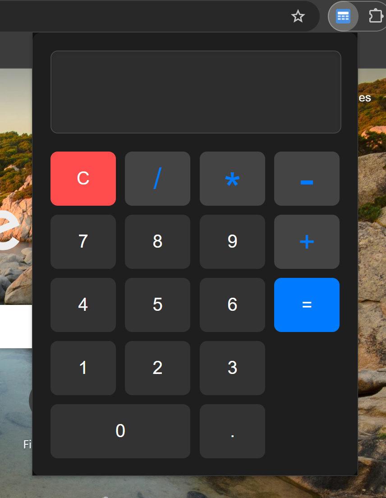

# Calculator Extension

Designed a sleek, professional and minimalist calculator extension. It features a dark theme, large and readable buttons and a clean layout for ease of use.

<div align="center">
  
</div>

---

## Installation

### Prerequisites
- A modern web browser (e.g., Chrome, Firefox, Edge).

### Steps
1. **Download the Extension**:
   - Clone this repository or download the ZIP file.
   ```
   git clone https://github.com/kbhavneet/chrome-extension-calc.git
   ```

2. **Load the Extension in your Browser**:
   - **Google Chrome**:
     1. Open Chrome and go to `chrome://extensions/`.
     2. Enable "Developer mode" (toggle in the top-right corner).
     3. Click "Load unpacked" and select the folder containing the extension.
   - **Mozilla Firefox**:
     1. Open Firefox and go to `about:debugging#/runtime/this-firefox`.
     2. Click "Load Temporary Add-on" and select the `manifest.json` file in the extension folder.

3. **Pin the Extension**:
   - Once loaded, pin the extension to your browser toolbar for easy access.

---

## Usage

1. **Open the Calculator**:
   - Click the extension icon in your browser toolbar to open the calculator.

2. **Perform Calculations**:
   - Use the buttons to input numbers and operators.
   - The result will be displayed in the input field at the top.

3. **Keyboard Support**:
   - You can also use your keyboard to input numbers and operators.

---

## Customization

If you'd like to customize the calculator's appearance or functionality:
1. Open the `popup.css` file to modify the styles (e.g., colors, button sizes).
2. Open the `popup.js` file to change the calculator's logic or add new features.

---

Bhavneet Kaur =)
